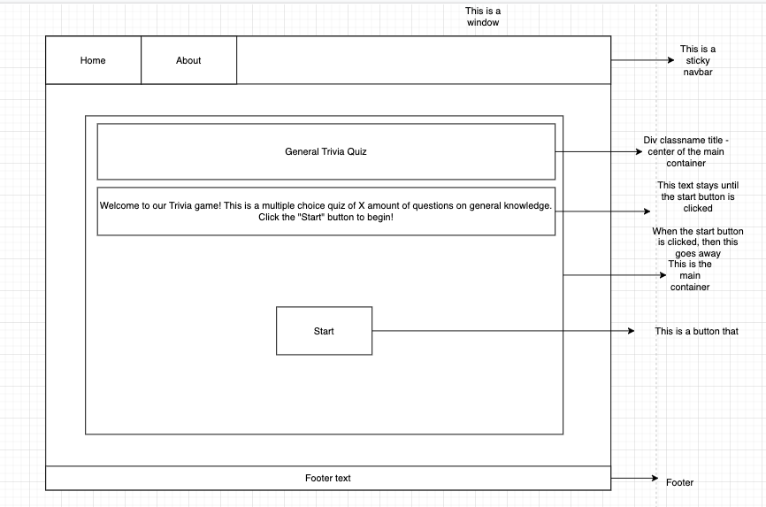

# Project two - Trivia API


## Deployment

Play Trivia here: https://sei-project2-quiz.netlify.app/

## Project Overview

We had 36 hours to create a React Website using a public API. This was a pair project. We found a public trivia API. The key concept of this was to use a public API and make an interactive website using React. I set up the API to run inside the front end using Axios, and useEffect and added filters and map methods to view the data inside of the app in the JSX section. I also worked more on the Front-end and refactored some of the code to make it viewable on mobile devices.

## Technologies used:

### Front end:
* React
* JSX
* Axios
* SCSS
* React Router Dom

### API:
* The Trivia DB - https://the-trivia-api.com/

### Dev Tools:
* VS code
* Yarn
* Insomnia
* Git
* GitHub
* Google Chrome dev tools
* Excalidraw (Wireframing)
* Netlify (deployment)

### Dev Tools:
* Clone or download the repo
* Install Yarn in the terminal with command: yarn
* Start server with the terminal command: yarn start

# The Approach Taken: 

Once the team was decided, we planned our MVP and aim for project 2. We started a blueprint using app.diagrams.net and made a small design of how the website will look like. The image below is our design for the trivia game. 





It gave us a feel for what we wanted. The front-end plan was completed with the divs and overall HTML layout. The next part of the plan was on who would do what. We came up with a blueprint using Excalidraw which showed what tasks needed to be completed. Communication was a key part of the project. We met regularly using Google Meetup and Zoom throughout the project. Using Visual code live share was a great benefit but it was tricky to use as it was updating properly when using.


The first requirement for the project was choosing the public API. After searching the internet and using various websites like RapidAPI and mixed analytic, we found an API both myself and my teammate wanted to use. We checked that the API would work by using Insomnia, with the result shown below. 

 Link - https://the-trivia-api.com/api/questions?categories=general_knowledge&limit=10&difficulty=ea


# The first 24 hours with code snippets: 

With planning out of the way we began the hackathon coding and created a trivia game based on a public API. Since this was my first pair project, I started using a git repository and began using Axios with useEffect to run the public API. 

```Javascript
    // AXIOS GET REQUEST
  useEffect(() => {

      const getData = async () => {
        try {
          const { data } = await axios.get('https://the-trivia-api.com/api/questions')
          // console.log(data)
          setTestData(data)
          // ! this will be the entire API library
        } catch (error) {
          console.log(error)
        }
      }
      getData()
    }, [visibleQuestion])
```

Once the API was running, we started to install all relevant packages inside the program. We had some issues using VS Live share which wasn’t responding to my screen and it wasn’t updating the changes to my partner screen or vice-versa. I wasn’t always able to see my teammate's local changes. To resolve this issue we tried using git add and push and pulling the relevant data every few hours but ran into some issues as Alex was using a Windows computer. So I decided we should zip the file and send it by google drive with every big change and communicate with Zoom and slack throughout the project. 

### Phase 1: Displaying each question one at a time with all four options. 

The first challenge was to display each of the questions one at a time with all four options: correct answers and incorrect answers. I started by accessing the API. We used a useEffect and Axios to load the API data on page load and have it show each of the questions shown in the console log. At first, it displayed all the questions and answers. I started by using React Hooks to hide the visibility of the questions by using a conditional operator and then by using the JS map method to map through the data.  

```Javascript
    // QUESTION
 const Question = ({ testData, setStartVisibility, setVisible }) => {
  function showStart() {
    setStartVisibility(true)
    setVisible(false)
  }
  const [questionIndex, setQuestionIndex] = useState(0)

  const [score, setScore] = useState(0)
```

```Javascript
    // FILTER BUTTON
      <div className='hero-container'>
        {testData.filter((item, index) => index === questionIndex).map((item, index) => {
          const { question, correctAnswer, incorrectAnswers, category, difficulty } = item
                   
            arrayMagic(correctAnswer, incorrectAnswers) 
            return (
              <div className='question-section'>
                <div className='text'>
                <h3>Question category: {category}</h3>
                <h3>Question difficulty: {difficulty}</h3>
                <h3>Question {questionIndex} out of {testData.length} </h3>
                <h2>Your score is: {score}</h2>
                <h3>{question}</h3>
                </div>
                {newArray.map(answer => {
                  return (
                  <div className='button-correct'>
                  <Col  className='col-lg-12 col-md-4 mb-5' >
                  <Button  className='btn btn-lg btn-block' variant="outline-primary" size="lg" value={answer} onClick={(event) => { compareAnswers(event, correctAnswer); }}>{answer}</Button>
                  </Col>
                 </div>
                  )
                  })}
                
              </div>
            )
          
```
The next part was finding a way to index the questions, so we could find the start of each question based on the length of Trivia API. By doing this again using Hooks, increment the question Index by adding one. We could change the question based on the index.

The next was to display the next question one at a time, after you have selected an answer for this we need to track the index of the Questions. As the array starts at 0, we needed to add one to the index. 

We came up with the solution by creating a new function and using the useState - setQuestionIndex. We made an index in the map to be equal to the questionIndex and then we setQuestionIndex to add one to the questionIndex.


```Javascript
    // COMPARE ANSWERS
 function compareAnswers(event, correctAnswer) {

    setQuestionIndex(questionIndex + 1)
    if (event.target.value === correctAnswer) {
      setScore(score + 1)
    }
  }
 
  let newArray
  function arrayMagic(correctAnswer, incorrectAnswers) {
    
    newArray = [...incorrectAnswers, correctAnswer ].sort()
  }
```


### Phase 2: Adding a Scoreboard 

With all the questions displayed one at a time, our next focus was creating a score base system. By using another useState, to store the score and setting the useState to zero. Created a function to hold the index to hold the value of the event and correctAnswer. 

```Javascript
    // ADDING CORRECT ANSWERS
   const [score, setScore] = useState(0)

  function compareAnswers(event, correctAnswer) {

    setQuestionIndex(questionIndex + 1)
    if (event.target.value === correctAnswer) {
      setScore(score + 1)
    }
  }
```
Inside the function, if the event value is the correctAnswer the score will be added by one. By setting this function, we then call this function to look for the correct answer in the API and if it is selected the score will add one. 

Then using an if statement gets the index to be equal to the questionIndex and returns the question by mapping through the data to access the incorrectAnswers and return these indexes as a button in an HTML format. 


```Javascript
    // ADDING CORRECT ANSWERS
          {testData.filter((item, index) => index === questionIndex).map((item, index) => {
          const { question, correctAnswer, incorrectAnswers, category, difficulty } = item
                   
            arrayMagic(correctAnswer, incorrectAnswers) 
            return (
              <div className='question-section'>
                <div className='text'>
                <h3>Question category: {category}</h3>
                <h3>Question difficulty: {difficulty}</h3>
                <h3>Question {questionIndex} out of {testData.length} </h3>
                <h2>Your score is: {score}</h2>
                <h3>{question}</h3>
                </div>
                {newArray.map(answer => {
                  return (
                  <div className='button-correct'>
                  <Col  className='col-lg-12 col-md-4 mb-5' >
                  <Button  className='btn btn-lg btn-block' variant="outline-primary" size="lg" value={answer} onClick={(event) => { compareAnswers(event, correctAnswer); }}>{answer}</Button>
                  </Col>
                 </div>
                  )
                  })}
                
              </div>
            )
          
        })}
        {questionIndex >= testData.length ? [<h1 className='display-3'>Quiz complete! Your final score is: {score}</h1>, 
        <div className='startQuiz '><button className='newQuiz btn btn-success btn-sm' onClick={showStart}>
          <h2 className='start-newQuiz'>Start new quiz</h2>
        
          </button></div>, testData.map((item, index) => {
          const { question, correctAnswer, incorrectAnswers } = item
          return(
  
              <Container as='main'>
                <div className='questionAnswered'>
                <h3 className='question'>{question}</h3>
                <h3 className='answers'>Correct answer: {correctAnswer}</h3>
                <h3 className='incorrect-answer'>Incorrect answers: {incorrectAnswers.map((answer, index) => {
                  return (index + 1 === incorrectAnswers.length ? `${answer}`: `${answer}, `)
                })}</h3>
                </div>
            
              </Container>
           
          )
        })  ]: ""  } 
        </div>
    </>
```


### Phase 3: Random correct answer and incorrect answer 

In the third phase, all the questions and answers were being generated one at a time but found that the correct answers and incorrect answers positioned weren’t randomly generating each of the options positions. We opted on using Array destructuring assignment syntax to unpack the values of each array. 

By creating a new global variable called newArray with no value and inside the function to compare the result we added inside the parameters both the correctAnswer and the incorrect Answers. 

This has to be let as the variable needed to be changed and with that, we made a new function called arrayMagic. Inside this function, we will hold the correct answer and incorrect answer and combine them by using a sort method. This was a simple way so that each option would be displayed randomly. 

```Javascript
    // SORTING CORRECT ANSWERS AND INCORRECT ANSWER
 let newArray
  function arrayMagic(correctAnswer, incorrectAnswers) {
    
    newArray = [...incorrectAnswers, correctAnswer ].sort()
  }

```

### Phase 4: Displaying all the questions and incorrect questions at the end of the quiz

So displaying the questions at the end of the quiz was our stretch goal. We first needed to find the length of the quiz, by using the questionIndex and if it's greater or equal we have reached the end of the quiz, so if the index of the current question is the same or higher than the length of the array, it then means there are no other questions left. 

I then used Square brackets, because it allows us to execute multiple things inside that ternary once met, so again mapping the questions, incorrect questions and the length of the question. The result will be that the entire questions, answers and incorrect answers will be displayed at the very end of the quiz. 

```Javascript
    // SHOWING ALL CORRECT ANSWERS AND INCORRECT ANSWER AT THE END
</div>, testData.map((item, index) => {
          const { question, correctAnswer, incorrectAnswers } = item
          return(
  
              <Container as='main'>
                <div className='questionAnswered'>
                <h3 className='question'>{question}</h3>
                <h3 className='answers'>Correct answer: {correctAnswer}</h3>
                <h3 className='incorrect-answer'>Incorrect answers: {incorrectAnswers.map((answer, index) => {
                  return (index + 1 === incorrectAnswers.length ? `${answer}`: `${answer}, `)
                })}</h3>
                </div>
            
              </Container>
           
          )
        })  ]: ""  } 
        </div>

```


## Final Product


### Home Page: 


### Question Page: 


### Final Page: 


## Wins & Challenges & Bugs

### Win
* The biggest win was getting the scoreboard working and getting the result displayed on the last page after completing the Trivia page.

### Challenges
* Was randomizing the quiz for the game. Randomise the correct answers and incorrect answer in the Trivia position. 
* As this was our first pair project we did have some issues with github with pushing and pulling data. As Alex was working on a window OS we did have some software and hardware issues but were available to resolve them by communicating with Zoom to discuss problems. 
 
### Bugs
* There are some obvious bugs I would like to address, and will be revisiting the react-API making it compatible with small devices like mobile and tablet devices. If you use the trivia on a mobile phone with less than 600px the buttons disappear, I hope that using react-bootstrap will be an easy fix as I know it is responsive to the size of the device. 

## Future improvements:

* I would like to fix the button press as the colour remains when the next question gets loaded.
* I would like to update some of the stylings and see if I could make the react button work or use CSS to hide the button but would need to look at it more. 


## Key learnings
This was my first time working on a pair project and I have learned a lot working with Alex. It was a unique experience coming from our previous project and working together we were able to overcome our strengths and weaknesses in making a Trivia App using a public API. There were many issues and one of the key components coming from this project was the hardware compatibility issues both Alex had to solve. Using conditional JS to map through and using a variety of useState throughout this project. 
